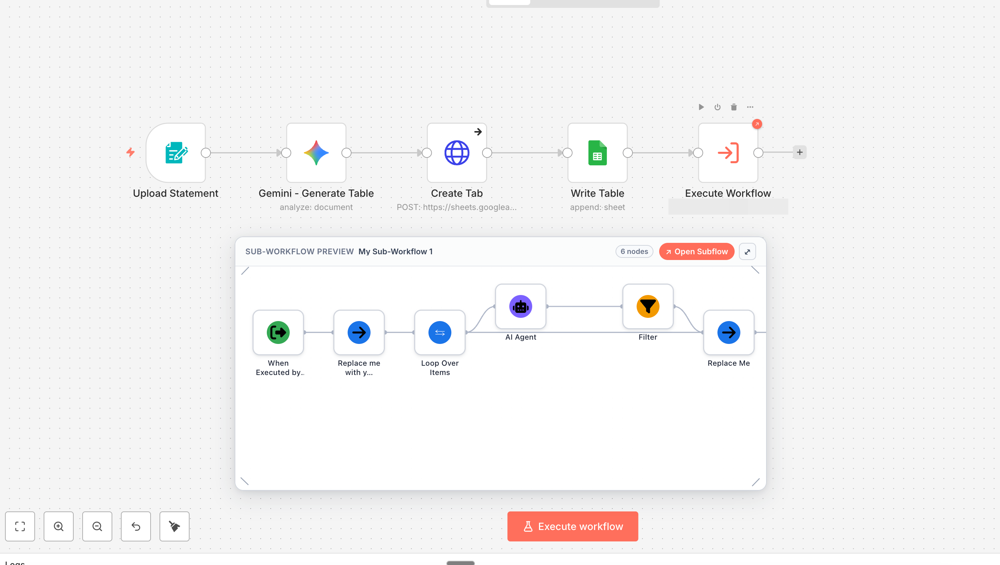
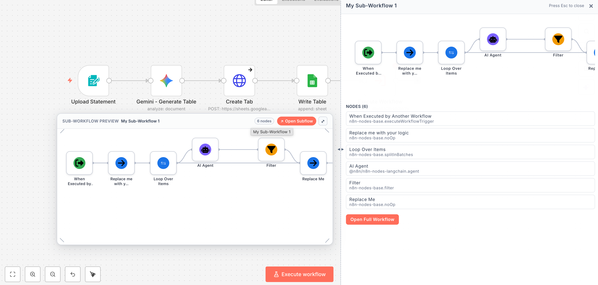
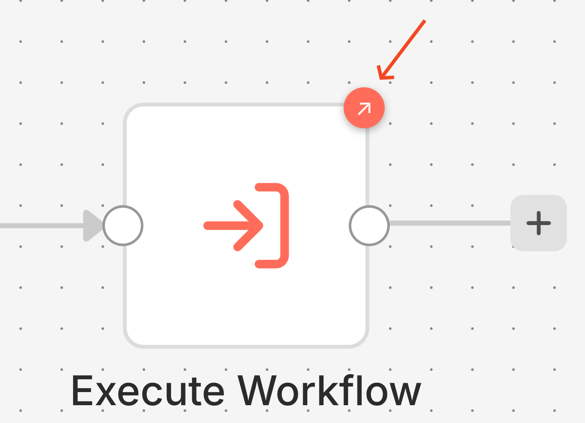
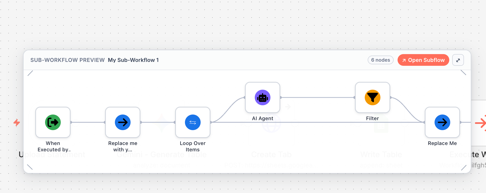
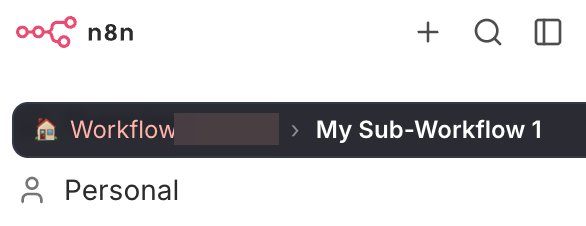

# n8n SubFlow Preview

**See what's inside your sub-workflows without leaving the canvas.**

A Chrome extension that gives you inline visual previews of any Execute Workflow node in n8n — no more opening sub-workflows in new tabs just to see what's inside.


---

## The Problem

When building complex automations in n8n, you often break things into multiple workflows connected via **Execute Workflow** nodes. The problem? You can't see what's inside those sub-workflows without clicking "Open in new tab" — which breaks your flow, forces context-switching, and makes it hard to understand the full picture.

## The Solution

Hover over any Execute Workflow node and instantly see a visual mini-map of the referenced sub-workflow, complete with node icons, connections, and metadata — right on the canvas.

---

## Features

### 🔍 Hover Preview
Hover over any Execute Workflow node to see a floating card showing the sub-workflow's structure — nodes, connections, and layout — rendered as an inline mini-map.



### ↗ Open Subflow Button
One click to open the sub-workflow in a new tab — directly from the hover preview header. No need to double-click the node and navigate through menus.

### 📋 Side Panel (Expanded View)
Click "Expand" to open a resizable side panel with a larger workflow visualization, a full node list with types, the workflow description, and a direct link to open the full workflow. Drag the left edge to resize the panel to your preferred width — it's saved across sessions.



### 🔖 Visual Badges
Execute Workflow nodes get a small badge indicator (↗) so you can instantly spot which nodes reference external workflows — even before hovering.



### ↔️ Draggable & Resizable Overlay
The preview overlay can be dragged anywhere on screen and resized from any corner. Your preferred size is saved across sessions. The mini-map re-renders dynamically to fill whatever size you choose — giving node names and complex workflows more room to breathe.



### 🧭 Breadcrumb Navigation
When you navigate into sub-workflows, a breadcrumb bar appears at the top showing your path — click any segment to jump back.



### 🗺️ Pannable Mini-Maps
For larger workflows, click and drag inside the mini-map to pan around and explore the full workflow structure — in both the hover overlay and the side panel.

### 🎨 Theme Support
Automatically detects n8n's light or dark theme and matches the preview styling accordingly.

### ⚡ Zero Configuration on n8n Cloud
If you're logged into n8n Cloud, the extension works immediately — no API keys needed. It piggybacks on your existing session by reading n8n's internal Pinia store directly.

---

## How It Works

The extension injects into n8n's workflow editor page and:

1. **Reads n8n's internal state** — accesses the Vue/Pinia store to get the current workflow's node data (no API calls needed for the current workflow)
2. **Identifies Execute Workflow nodes** — specifically targets `n8n-nodes-base.executeWorkflow` (caller nodes), never trigger nodes
3. **Fetches sub-workflow data** — uses n8n's internal API with your existing session authentication
4. **Renders a mini-map** — takes the node positions and connections from the sub-workflow JSON and draws a scaled-down visualization with color-coded nodes and bezier curve connections
5. **Resolves icons** — fetches real node icons from n8n's assets and Font Awesome CDN for accurate visual representation

---

## Installation

### From Source (Developer Mode)

1. **Download** — Clone this repo or download as ZIP:
   ```bash
   git clone https://github.com/netanelda/n8n-subflow-preview.git
   ```

2. **Open Chrome Extensions** — Navigate to `chrome://extensions/`

3. **Enable Developer Mode** — Toggle the switch in the top-right corner

4. **Load the extension** — Click "Load unpacked" and select the `n8n-subflow-preview` folder

5. **Navigate to n8n** — Open your n8n instance and go to any workflow with Execute Workflow nodes

6. **Hover and preview** — Hover over an Execute Workflow node to see the magic ✨

### Settings (Optional)

Click the extension icon in Chrome's toolbar to access settings:
- **Preview delay** — Adjust how quickly the preview appears on hover (200ms–1000ms)
- **Theme** — Auto-detect, light, or dark
- **Toggle features** — Enable/disable hover preview, badges, or breadcrumbs individually

For **self-hosted n8n instances** that don't use session-based auth, you may need to configure an API key in the extension settings.

---

## Compatibility

| Environment | Status | Notes |
|---|---|---|
| n8n Cloud | ✅ Works | Zero-config, uses session auth |
| Self-hosted n8n | ✅ Works | May need API key for sub-workflow fetching |
| n8n Desktop | ⚠️ Untested | Should work if running in Chrome |
| n8n v1.x+ | ✅ Works | Tested with modern canvas |

---

## Security

This extension takes security seriously:

- **Smart page detection** — Only activates on pages that are actually n8n (checks URL patterns + DOM markers). Does not inject scripts or override browser APIs on non-n8n sites.
- **No data collection** — Zero analytics, tracking, or external requests (except to your own n8n instance and Font Awesome CDN for icons).
- **Auth header cleanup** — Captured authentication headers are stored in closures (not global scope) and cleared after use.
- **PostMessage validation** — All cross-context messages are origin-validated to prevent injection.
- **Icon URL sanitization** — Only allows `https://`, `localhost`, and `data:image/` URLs for node icons.
- **Cache sanitization** — Sensitive fields (API keys, passwords, tokens) are stripped from cached workflow data.
- **Your API key stays local** — Stored in `chrome.storage.local`, never transmitted anywhere except your own n8n instance.

---

## Tech Stack

- **Manifest V3** Chrome Extension
- **Vanilla JavaScript** — no frameworks, no build step
- **SVG** for workflow mini-map rendering
- **Vue/Pinia store access** for zero-config data fetching
- **Font Awesome CDN** for node icon resolution

---

## Project Structure

```
n8n-subflow-preview/
├── manifest.json              # Extension manifest (V3)
├── background.js              # Service worker — API key fallback relay
├── content/
│   ├── content.js             # Main content script — detection, hover, UI
│   ├── content.css            # All styles — overlay, badges, panel, breadcrumbs
│   ├── page-probe.js          # Pinia store access + auth header capture
│   ├── preview-renderer.js    # Mini-map rendering engine
│   └── side-panel.js          # Expandable side drawer
├── popup/
│   ├── popup.html             # Extension settings UI
│   ├── popup.css              # Settings styles
│   └── popup.js               # Settings logic
├── utils/
│   ├── cache.js               # In-memory + chrome.storage caching
│   ├── n8n-api.js             # REST API fallback fetcher
│   └── theme.js               # Light/dark theme detection
└── icons/                     # Extension icons
```

---

## Contributing

Found a bug? Have an idea? Feel free to [open an issue](https://github.com/netanelda/n8n-subflow-preview/issues) or submit a pull request.

---

## License

MIT — do whatever you want with it.

---

Built with ☕ and Claude by [Netanel Da](https://github.com/netanelda)
